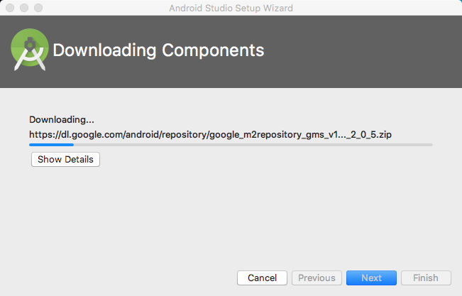
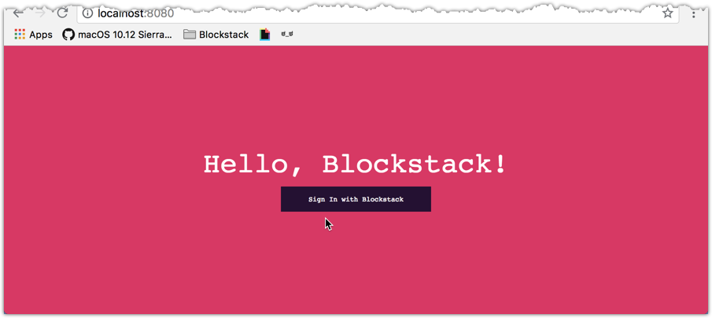
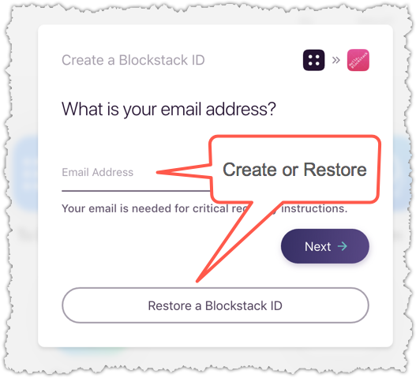
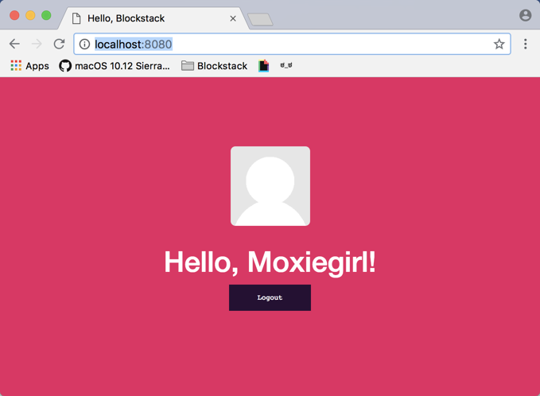
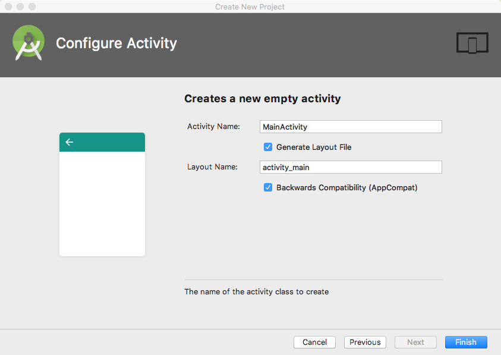
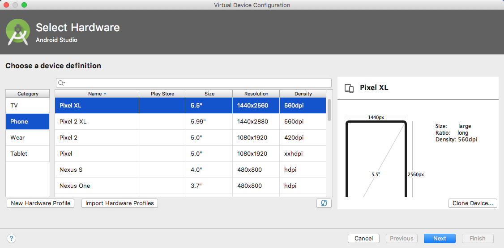
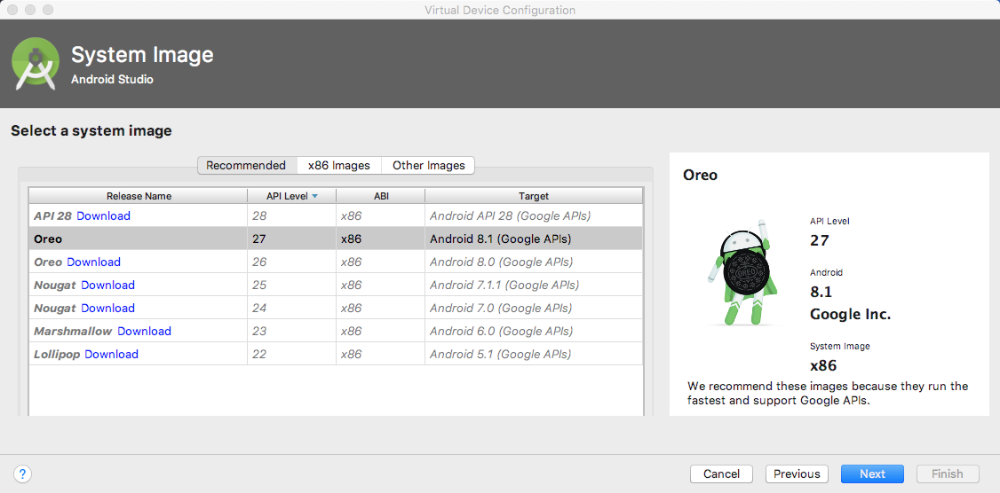
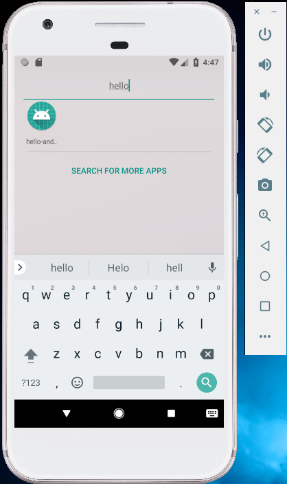
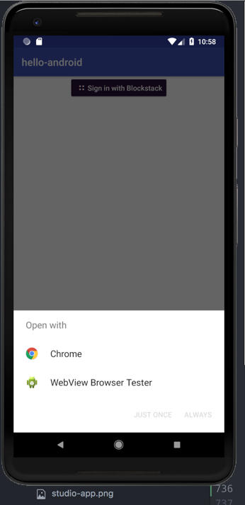

# Blockstack Android SDK Tutorial (Pre-release)

This tutorial is written for readers who are new to either or both Blockstack
and Android to create a decentralized application. It contains the following
content:

- [Blockstack Android SDK Tutorial (Pre-release)](#blockstack-android-sdk-tutorial-pre-release)
- [Understand the sample application flow](#understand-the-sample-application-flow)
- [Set up your environment](#set-up-your-environment)
	- [Install Android Studio](#install-android-studio)
	- [Create a Blockstack ID for testing](#create-a-blockstack-id-for-testing)
	- [Do you have npm?](#do-you-have-npm)
	- [Use npm to install Yeoman and the Blockstack App Generator](#use-npm-to-install-yeoman-and-the-blockstack-app-generator)
- [Build the Blockstack hello-world](#build-the-blockstack-hello-world)
	- [Generate and launch your hello-blockstack application](#generate-and-launch-your-hello-blockstack-application)
	- [Add a redirect end point to your application](#add-a-redirect-end-point-to-your-application)
- [Create the hello-android project](#create-the-hello-android-project)
	- [Create a simple project](#create-a-simple-project)
	- [Run the app in an emulator](#run-the-app-in-an-emulator)
	- [Configure your application with the Blockstack SDK](#configure-your-application-with-the-blockstack-sdk)
	- [Add a simple interface](#add-a-simple-interface)
	- [Add session & authentication code](#add-session-authentication-code)
	- [Run the final app in the emulator](#run-the-final-app-in-the-emulator)
- [Where to go next](#where-to-go-next)

This tutorial was extensively tested using Android Studio 3.1 on a MacBook Air
running High Sierra 10.13.4. If your environment is different, you may encounter
slight or even major discrepancies when performing the procedures in this
tutorial. Please [join the Blockstack community
Slack](https://slofile.com/slack/blockstack) and post questions or comments to
the `#support` channel.

Finally, this tutorial is written for all levels from the beginner to the most
experienced. For best results, beginners should follow the guide as written. It
is expected that the fast or furiously brilliant will skip ahead and improvise
on this material at will. Fair journey one and all.

If you prefer, you can skip working through the tutorial all together. Instead,
you can [download the final project code](images/helloandroid.zip) and import it
into Android Studio to review it.

## Understand the sample application flow

When complete, the sample application is a simple `hello-world` display. It is
intended for user on an Android phone.


Only users with an existing `blockstack.id` can run your
final sample application. When complete, users interact with the sample
application by doing the following:


## Set up your environment

This sample application has two code bases, a BlockStack `hello-blockstack`
application and a `hello-andriod` Android application. Before you start
developing the sample, there are a few elements you need in your environment.

### Install Android Studio

If you are an experienced Android developer and already have an Android
development environment on your workstation, you can use that and skip this
step. However, you will need to adjust the remaining instructions for your
environment.

Follow the installation instructions to download and [Android Studio
3.1](https://developer.android.com/studio/install) for your operating system.
Depending on your network connection, this can take between 15-30 minutes.



### Create a Blockstack ID for testing

Skip this section if you already have a Blockstack ID.

The Blockstack Browser gives users the ability to explore and use the
decentralized applications (dapps).  For this example, you should make sure you
have an existing identity before you begin developing your mobile app.

To create an inititial Blockstack ID, do the following:

1. Open the [Blockstack web application in your browser](https://browser.blockstack.org/sign-up?redirect=%2F).

   The application prompts you for an email address.

   

   Blockstack uses this email address to send you recovery information. Your
   email is not stored by BlockStack.

2. Enter an email address and press **Next**.

   The application prompts you to enter a password. Blockstack uses this
   password to encrypt your recovery code. You must record and save this
   initial password.

   **NOTE**:The Blockstack team cannot restore your password for you.

3. Enter a password, confirm it, and press **Next**.

   

   The browser prompts you to register a unique username in the `id.blockstack`
   domain. This is your identity in the decentralized internet. The format of the id
   is:

    _`username`_`.id.blockstack`

    You'll use this initial ID to access the Blockstack Browser.

3.  Enter a unique username and press **Check Availability**.

    


4.  Press **Continue**.

    The system prompts you to save your **recovery code**. A recovery code is a
    sequence  of words.  These words allow you to recover an `id.blockstack`
    that you've created.  You should store the words along with their order, for
    example,  `#1 applied` and so forth.

5. Click **I have written down all the words** when you are done.

   The system places you in the Blockstack browser.

### Do you have npm?

The Blockstack code in this tutorial relies on the `npm` dependency manager.
Before you begin, verify you have installed `npm` using the `which` command to
verify.

```bash
$ which npm
/usr/local/bin/npm
```

If you don't find `npm` in your system, [install it](https://www.npmjs.com/get-npm).


### Use npm to install Yeoman and the Blockstack App Generator

You use `npm` to install Yeoman. Yeoman is a generic scaffolding system that
helps users rapidly start new projects and streamline the maintenance of
existing projects.


1. Install Yeoman.

    ```bash
    npm install -g yo
    ```
2. Install the Blockstack application generator.

    ```bash
    npm install -g generator-blockstack
    ```


## Build the Blockstack hello-world

In this section, you build a Blockstack `hello-world` application. Then, you
modify the `hello-world` to interact with the Android app via a redirect.

### Generate and launch your hello-blockstack application

In this section, you build an initial React.js application called
`hello-blockstack`.

1. Create a `hello-blockstack` directory.

    ```bash
    mkdir hello-blockstack
    ```

2. Change into your new directory.

    ```bash
    cd hello-blockstack
    ```

3. Use Yeoman and the Blockstack application generator to create your initial `hello-blockstack` application.

    ```bash
    yo blockstack:react
    ```

    You should see several interactive prompts.

    ```bash
    $ yo blockstack:react
    ==========================================================================
    We are constantly looking for ways to make yo better!
    May we anonymously report usage statistics to improve the tool over time?
    More info: https://github.com/yeoman/insight & http://yeoman.io
    ========================================================================== No

         _-----_     ╭──────────────────────────╮
        |       |    │      Welcome to the      │
        |--(o)--|    │      Blockstack app      │
       `---------´   │        generator!        │
        ( _´U`_ )    ╰──────────────────────────╯
        /___A___\   /
         |  ~  |
       __'.___.'__
     ´   `  |° ´ Y `

    ? Are you ready to build a Blockstack app in React? (Y/n)
    ```

4. Respond to the prompts to populate the initial app.

    After the process completes successfully, you see a prompt similar to the following:

    ```bash
    [fsevents] Success:
    "/Users/theuser/repos/hello-blockstack/node_modules/fsevents/lib/binding/Release/node-v59-darwin-x64/fse.node"
    is installed via remote npm notice created a lockfile as package-lock.json.
    You should commit this file. added 1060 packages in 26.901s
    ```

5. Run the initial application.

    ```bash
    npm start

    > hello-blockstack@0.0.0 start /Users/moxiegirl/repos/hello-blockstack
    > webpack-dev-server

    Project is running at http://localhost:8080/
    webpack output is served from /
    404s will fallback to /index.html
    Hash: 4d2312ba236a4b95dc3a
    Version: webpack 2.7.0
    Time: 2969ms
                                     Asset       Size  Chunks                    Chunk Names
    ....
      Child html-webpack-plugin for "index.html":
         chunk    {0} index.html 541 kB [entry] [rendered]
             [0] ./~/lodash/lodash.js 540 kB {0} [built]
             [1] ./~/html-webpack-plugin/lib/loader.js!./src/index.html 533 bytes {0} [built]
             [2] (webpack)/buildin/global.js 509 bytes {0} [built]
             [3] (webpack)/buildin/module.js 517 bytes {0} [built]
     webpack: Compiled successfully.
     ```

   The system opens a browser displaying your running application.

   

   At this point, the browser is running a Blockstack server on your local host.
   This is for testing your applications only.

6. Choose **Sign in with Blockstack**

   The system displays a prompt allowing you to create a new Blockstack ID or restore an existing one.

    

7. Follow the prompts appropriate to your situation.

    If you are restoring an existing ID, you may see a prompt about your user
    being nameless, ignore it. At this point you have only a single application
    on your test server.  So, you should see this single application, with your
    own `blockstack.id` display name, once you are signed in:

    


### Add a redirect end point to your application

When a user opens the webapp from the Blockstack browser on an Android phone,
you want the web app to redirect the user to your Android application. The work
you do here will allow it.

1. From the terminal command line, change directory to the root of your sample
application directory.

2. Use the `touch` command to add a redirect endpoint to your application.

    This endpoint on the web version of your app will redirect Android users back
    to your mobile app.

    ```bash
    $ touch public/redirect.html
    ```

3. Open `redirect.html` and add code to the endpoint.

    ```
    <!DOCTYPE html>
    <html>
    <head>
      <title>Hello, Blockstack!</title>
      <script>
      function getParameterByName(name) {
        var match = RegExp('[?&]' + name + '=([^&]*)').exec(window.location.search);
        return match && decodeURIComponent(match[1].replace(/\+/g, ' '));
      }

      var authResponse = getParameterByName('authResponse')
      window.location="myblockstackapp:" + authResponse
      </script>
    <body>
    </body>
    </html>
    ```

    Blockstack apps are identified by their domain names.  The endpoint will
    receive a get request with the query parameter `authResponse=XXXX` and
    should redirect the browser to `myblockstackapp:XXXX`.

    `myblockstackapp:` is custom protocol handler. The handler should be unique
    to your application. Your app's web-based authentication uses this handler
    to redirect the user back to your Android app. Later, you'll add a reference
    to this handler in your Android application.

5. Close and save the `redirect.html` file.
6. Ensure your Blockstack compiles successfully.


## Create the hello-android project

In this section, you'll create an Android application in Android Studio.  You'll
run the application in the emulator to test it.

### Create a simple project

In this section, you create an inital project. You'll validate the application's
iniatial state by creating an emulator to run it in. Open Android Studio and do the following:


1. Open Android Studio and choose **Start a new Andriod Studio project**.

   If studio is already started, choose **File > New > New Project**.

2. Enter these fields in the **Create Android Project** page.

    <table>
    <tr>
      <th>Application Name</th>
      <td><code>hello-android</code></td>
    </tr>
    <tr>
      <th>Company domain</th>
      <td><code><i>USERNAME</i>.example.com</code></td>
    </tr>
    <tr>
      <th>Project location</td>
      <td><code>/Users/<i>USERNAME</i>/AndroidStudioProjects/helloandroid</code></td>
    </tr>
    <tr>
      <th>Include Kotlin support</th>
      <td>Set (checked)</td>
    </tr>
    </table>

3. Press **Next** to display **Target Android Devices**.
4. Check **Phone and Tablet**.
5. Choose API 27: Andriod 8.1 (Oreo) for the target version.
6. Press **Next**.
7. Choose **Empty Activity** and press **Next**.
8. Leave the **Configure Activity** dialog with its defaults.

   

9. Press **Finish**.

   Android studio builds your initial project. This can take a bit the first time you do it.

   

### Run the app in an emulator

In this section, you run the appliation and create an emulator when prompted.

1. Once the project is imported into studio, click the `app` module in the **Project** window.

2. Then, select **Run > Run** (or click the green arrow  in the toolbar).

   Studio prompts you to **Select Deployment Target**.

3. Choose **Create New Virtual Device** and press **OK**.

    Studio prompts you to **Select Hardware**.

4. Choose a Phone running Pixel XL.

    

    Studio prompts you for a system image.

5. Choose **Oreo** which is API level 27 and press **Next**.

    

    Studio asks you to verify your new emulator configuration.

6. Press **Finish**.

    The emulation takes a moment to build. Then, studio launches the emulation and opens your application.

    


### Configure your application with the Blockstack SDK

Now that you have created your initial project and verified it running in an emulator, you are ready to begin configuring the application for use with Blockstack.

1. In studio, open the `AndroidManifest.xml` file.
2. Add an `<intent-filter>` with the custom handler for Blockstack.

    ```XML
    <intent-filter>
      <action android:name="android.intent.action.VIEW" />
      <category android:name="android.intent.category.DEFAULT" />
      <category android:name="android.intent.category.BROWSABLE" />
      <data android:scheme="myblockstackapp" />
     </intent-filter>
    ```

2. Open the Project's `build.gradle` file.
3. Add the Jitpack repository `maven { url 'https://jitpack.io' }` to the `repositories` section.

    When you finish, that section looks like this:

    ```JS
    allprojects {
      repositories {
          google()
          jcenter()
          maven { url 'https://jitpack.io' }
      }
    }
    ```

4. Open the Module `build.gradle` file.
5. Set the `defaultConfig minSdkVersion` to `19`.

   When you are done, you should see (within your own username not `moxiegirl`):

   ```JS
   android {
       compileSdkVersion 27
           defaultConfig {
               applicationId "com.example.moxiegirl.hello_android"
               minSdkVersion 19
               targetSdkVersion 27
               versionCode 1
               versionName "1.0"
               testInstrumentationRunner "android.support.test.runner.AndroidJUnitRunner"
           }
      ...
   }
    ```

7. Below this, add the Blockstack Android SDK dependency to your project's `dependencies` list:

    When you are done you should see:

    ```JS
    dependencies {
        implementation "org.jetbrains.kotlin:kotlin-stdlib-jdk7:$kotlin_version"
        implementation 'com.android.support:appcompat-v7:27.1.0'
        implementation 'com.android.support.constraint:constraint-layout:1.1.2'
        testImplementation 'junit:junit:4.12'
        androidTestImplementation 'com.android.support.test:runner:1.0.2'
        androidTestImplementation 'com.android.support.test.espresso:espresso-core:3.0.2'
        implementation 'com.github.blockstack:blockstack-android:0.3.0'
    }

    ```

    **NOTE**: Ignore the warning on the appcompat` dependencies.

8. Sync your project.

    

    Be sure to check the sync completed successfully.

    

10. Run your app in the emulator.

    You've made a lot of changes, make sure the emulator is still running
    correctly.

### Add a simple interface

1.  Open the `app/res/layout/activity_main.xml` file.

    The `activity_main.xml` file defines the graphical elements. Some elements are required before you can functionality to your `MainActivity.kt` code.

3. Replace the entire content of the file with the following code:

   The new interface includes a `BlockstackSignInButton` which is provided by
   the SDK. This SDK includes a themed "Sign in with Blockstack" button
   (`BlockstackSignInButton`). You use this button in your here with the
   `org.blockstack.android.sdk.ui.BlockstackSignInButton` class.

    ```XML
    <?xml version="1.0" encoding="utf-8"?>
    <android.support.constraint.ConstraintLayout xmlns:android="http://schemas.android.com/apk/res/android"
    xmlns:app="http://schemas.android.com/apk/res-auto"
    xmlns:tools="http://schemas.android.com/tools"
    android:layout_width="match_parent"
    android:layout_height="match_parent"
    tools:context=".MainActivity">

    <org.blockstack.android.sdk.ui.BlockstackSignInButton
        android:id="@+id/signInButton"
        android:layout_width="307dp"
        android:layout_height="45dp"
        android:layout_margin="4dp"
        android:layout_marginEnd="185dp"
        android:layout_marginStart="39dp"
        app:layout_constraintEnd_toEndOf="parent"
        app:layout_constraintStart_toStartOf="parent"
        tools:layout_editor_absoluteY="16dp" />

    <TextView
        android:id="@+id/userDataTextView"
        android:layout_width="370dp"
        android:layout_height="27dp"
        tools:layout_editor_absoluteX="6dp"
        tools:layout_editor_absoluteY="70dp" />

    </android
    ```

    This codes adds a button and some text to your application.

4. Choose **Run > Apply changes**.

5. Choose **Run > Run app** in the emulator.

    The emulator now contains a new interface with a button:

    

### Add session & authentication code

1. Open the `MainActivity.kt` file.
2. Add some additional imports to the top below the `android.os.Bundle` import.

    When you are done, your imports should appear as follows:

    ```kotlin

    import android.support.v7.app.AppCompatActivity
    import android.os.Bundle

    import android.support.v7.app.AppCompatActivity
    import android.view.View
    import kotlinx.android.synthetic.main.activity_main.*
    import org.blockstack.android.sdk.BlockstackSession
    import org.blockstack.android.sdk.Scope
    import org.blockstack.android.sdk.UserData
    import java.net.URI
    ```
3. Add a variable for the Blockstack session before `onCreate`.

   ```kotlin
   class MainActivity : AppCompatActivity() {

    private var _blockstackSession: BlockstackSession? = null


    override fun onCreate(savedInstanceState: Bundle?) {
        super.onCreate(savedInstanceState)
        setContentView(R.layout.activity_main)
      }
    }
   ```

4. Replace the existing the `onCreate` function with the following:

    ```kotlin
    override fun onCreate(savedInstanceState: Bundle?) {
        super.onCreate(savedInstanceState)
        setContentView(R.layout.activity_main)

        signInButton.isEnabled = false

        val appDomain = URI("https://flamboyant-darwin-d11c17.netlify.com")
        val redirectURI = URI("${appDomain}/redirect")
        val manifestURI = URI("${appDomain}/manifest.json")
        val scopes = arrayOf(Scope.StoreWrite)

	val config = java.net.URI("https://flamboyant-darwin-d11c17.netlify.com").run {
            org.blockstack.android.sdk.BlockstackConfig(
                    this,
                    redirectURI,
                    manifestURI,
                    scopes
        }

        _blockstackSession = BlockstackSession(this, config,
                onLoadedCallback = {
                    signInButton.isEnabled = true
                })


        signInButton.setOnClickListener { view: View ->
            blockstackSession().redirectUserToSignIn { userData ->
                if (userData.hasValue) {
                    runOnUiThread {
                        onSignIn(userData.value!!)
                    }
                }
            }
        }
        if (intent?.action == Intent.ACTION_VIEW) {
            // handle the redirect from sign in
            handleAuthResponse(intent)
        }
    }
    ```

    This new `onCreate` does several things:

    * Define the initial state for the `signInButton`.
    * Supply authentication information for connecting to your Blockstack app: `appDomain`, `redirectURI`, `manifestURI` and `scopes`
    * Add a listener for the button click.

    Notice that the application in this example is a URI you have not set up.
    Registering and application name takes time, so in time's interest you'll
    use an existing app that is identical to the `hello-world` you created
    earlier. For a produciton verison, you'll need to replace `appDomain`,
    `redirectURI`, `manifestURI` and `scopes` with values appropriate for your
    app.

5. Add a private function to reflect when a user successfully signs in.

    ```kotlin
    private fun onSignIn(userData: UserData) {
    		userDataTextView.text = "Signed in as ${userData.decentralizedID}"

    		signInButton.isEnabled = false

    }
    ```

6. Handle sign in requests with an `onNewIntent` function if the activity was already opened when signing in

    Retrieve the authentication token from the custom protocol handler call and
    send it to the Blockstack session.

    ```kotlin
    override fun onNewIntent(intent: Intent?) {
      super.onNewIntent(intent)

      if (intent?.action == Intent.ACTION_VIEW) {
          handleAuthResponse(intent)
      }
    }
    ```

7. Create a handler for the authentication response.

    ```kotlin
    private fun handleAuthResponse(intent: Intent) {
       val response = intent.dataString
       if (response != null) {
           val authResponseTokens = response.split(':')

           if (authResponseTokens.size > 1) {
               val authResponse = authResponseTokens[1]

               blockstackSession().handlePendingSignIn(authResponse, { userData ->
                   if (userData.hasValue) {
                      // The user is now signed in!
                      runOnUiThread {
                         onSignIn(userData.value!!)
                      }
                   }
               })
           }
       }
    }
    ```

8. Add the convenience method to access the blockstack session.

    ```kotlin
    fun blockstackSession() : BlockstackSession {
      val session = _blockstackSession
       if(session != null) {
          return session
       } else {
        throw IllegalStateException("No session.")
      }
    }
    ```

9. Verify your final `MainActivity.kt` code looks like this:

    ```kotlin
    class MainActivity : AppCompatActivity() {

        private var _blockstackSession: BlockstackSession? = null


        override fun onCreate(savedInstanceState: Bundle?) {
            super.onCreate(savedInstanceState)
            setContentView(R.layout.activity_main)

            signInButton.isEnabled = false

            val appDomain = URI("https://flamboyant-darwin-d11c17.netlify.com")
            val redirectURI = URI("${appDomain}/redirect")
            val manifestURI = URI("${appDomain}/manifest.json")
            val scopes = arrayOf(Scope.StoreWrite)

            _blockstackSession = BlockstackSession(this, appDomain, redirectURI, manifestURI, scopes,
                    onLoadedCallback = {signInButton.isEnabled = true
                    })


            signInButton.setOnClickListener { view: View ->
                blockstackSession().redirectUserToSignIn { userData ->
                    if (userData.hasValue) {
                        runOnUiThread {
                            onSignIn(userData)
                        }
                    }
                }
            }
            if (intent?.action == Intent.ACTION_VIEW) {
                handleAuthResponse(intent)
            }
        }

        private fun onSignIn(userData: UserData) {
            userDataTextView.text = "Signed in as ${userData.decentralizedID}"

            signInButton.isEnabled = false

        }

        override fun onNewIntent(intent: Intent?) {
            super.onNewIntent(intent)

            if (intent?.action == Intent.ACTION_VIEW) {
                handleAuthResponse(intent)
            }
        }

        private fun handleAuthResponse(intent: Intent) {
            val response = intent.dataString
            if (response != null) {
                val authResponseTokens = response.split(':')

                if (authResponseTokens.size > 1) {
                    val authResponse = authResponseTokens[1]

                    blockstackSession().handlePendingSignIn(authResponse, { userData ->
                        if (userData.hasValue) {
                            // The user is now signed in!
                            runOnUiThread {
                                onSignIn(userData.value!!)
                            }
                        }
                    })
                }
            }
        }

        fun blockstackSession() : BlockstackSession {
            val session = _blockstackSession
            if(session != null) {
                return session
            } else {
                throw IllegalStateException("No session.")
            }
        }


    }
    ```

### Run the final app in the emulator

1. Choose **Run > Apply changes**.
2. Choose **Run > Run app** in the emulator.
3. When you see the application open, choose **Sign in with Blockstack**.

    The system prompts you how to open.

    

4. Choose **Chrome** and click **ALWAYS**.
5. Move through the rest of the Chrome prompts.

   The system presents you with your final application.

   

6. Work through the Blockstack prompts to login.


## Where to go next

Congratulations, you've completed your Android app using the new, pre-release
Blockstack Android SDK. Thank you for trying this pre-release. Please let us
know about your experience by tweeting to
[@blockstack](https://twitter.com/blockstack).

Learn more about Blockstack by [trying another tutorial](https://blockstack.org/tutorials).
